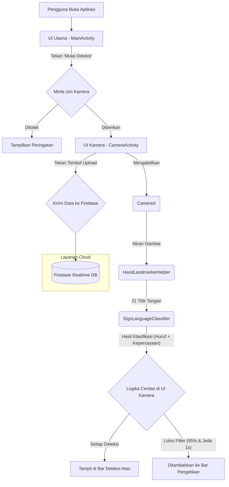

# JariBicara: Aplikasi Penerjemah Bahasa Isyarat Real-time

JariBicara adalah sebuah prototipe aplikasi Android yang mampu menerjemahkan Bahasa Isyarat Indonesia (BISINDO) abjad statis menjadi teks secara *real-time* menggunakan kamera perangkat. Aplikasi ini dibangun dengan pendekatan modern, mengintegrasikan *On-Device Machine Learning* dengan UI deklaratif dan layanan *cloud*.

---

## Fitur Utama

- **Terjemahan Real-time**: Menggunakan kamera untuk mendeteksi dan menerjemahkan isyarat tangan secara langsung.
- **Logika Pengetikan Cerdas**: Dilengkapi dengan filter kepercayaan (95%) dan jeda waktu (1 detik) untuk menghasilkan teks yang lebih akurat dan natural, serta menghindari duplikasi.
- **Dukungan Kamera Ganda**: Pengguna dapat dengan mudah beralih antara kamera depan dan belakang.
- **Integrasi Cloud**: Hasil teks dapat diunggah ke Firebase Realtime Database untuk disimpan sebagai riwayat.
- **UI Modern**: Seluruh antarmuka aplikasi dibangun menggunakan Jetpack Compose untuk tampilan yang bersih dan responsif.
- **Deteksi Offline**: Proses deteksi dan klasifikasi berjalan sepenuhnya di perangkat (*on-device*), sehingga tidak memerlukan koneksi internet untuk fungsi utamanya.

---

## Arsitektur & Alur Kerja

Aplikasi ini memiliki arsitektur yang memisahkan antara logika deteksi, logika tampilan, dan layanan eksternal.

#### Diagram Alur Data
Diagram ini menggambarkan bagaimana data gambar dari kamera diolah hingga menjadi teks dan disimpan di *cloud*.



#### Detail Alur Data & Komponen Penanggung Jawab
Berikut adalah rincian langkah demi langkah tentang bagaimana data bergerak melalui aplikasi dan komponen mana yang bertanggung jawab pada setiap tahap.

1.  **Pengambilan Gambar dari Kamera**
    *   **Sumber**: Sensor Kamera Perangkat.
    *   **Komponen**: `CameraActivity.kt`
    *   **Fungsi Kunci**: `ImageAnalysis.Builder()` (dari library CameraX) yang diatur di dalam `LaunchedEffect` pada Composable `CameraScreen`.
    *   **Output**: `ImageProxy` (representasi frame gambar mentah per satuan waktu).

2.  **Pra-pemrosesan Gambar**
    *   **Sumber**: `ImageProxy`.
    *   **Komponen**: `CameraActivity.kt`.
    *   **Fungsi Kunci**: Lambda di dalam `analyzer.setAnalyzer { ... }`.
    *   **Proses**: Memanggil `imageProxy.toBitmap()` dan melakukan rotasi/mirroring menggunakan objek `Matrix`.
    *   **Output**: `Bitmap` (gambar yang siap dianalisis).

3.  **Deteksi Landmark Tangan**
    *   **Sumber**: `Bitmap`.
    *   **Komponen**: `HandLandmarkerHelper.kt`.
    *   **Fungsi Kunci**: `detectLiveStream(bitmap)`. Di dalamnya, `handLandmarker.detectAsync()` dipanggil untuk menjalankan model MediaPipe.
    *   **Output**: Hasil deteksi 21 titik *landmark* tangan (dikirim secara asinkron).

4.  **Pengiriman Hasil Landmark ke UI**
    *   **Sumber**: Hasil dari `handLandmarker.detectAsync()`.
    *   **Komponen**: `HandLandmarkerHelper.kt` dan `CameraActivity.kt`.
    *   **Fungsi Kunci**: Hasil deteksi dikirim melalui *interface callback* `handLandmarkerResultsListener.onResults(...)`. `CameraActivity` bertindak sebagai "pendengar" dari hasil ini.
    *   **Output**: `HandLandmarkerHelper.ResultBundle` yang berisi data landmark.

5.  **Klasifikasi Isyarat menjadi Huruf**
    *   **Sumber**: Data 21 titik landmark dari `ResultBundle`.
    *   **Komponen**: `SignLanguageClassifier.kt`.
    *   **Fungsi Kunci**: `classify(landmarks)`. Fungsi ini dipanggil dari dalam `handLandmarkerResultsListener` di `CameraActivity.kt`.
    *   **Proses**: Mengubah 21 *landmark* menjadi 42 nilai *float*, dimasukkan ke `ByteBuffer`, dan dieksekusi oleh *interpreter* TensorFlow Lite.
    *   **Output**: Objek data `ClassificationResult` (berisi `sign` dan `confidence`).

6.  **Penerapan Logika Cerdas & Pengetikan**
    *   **Sumber**: Objek `ClassificationResult`.
    *   **Komponen**: `CameraActivity.kt`.
    *   **Fungsi Kunci**: Blok logika `if` di dalam `handLandmarkerResultsListener`.
    *   **Proses**: Memeriksa tiga kondisi: `confidence > 95%`, isyarat bukan duplikat, dan jeda waktu > 1 detik terpenuhi.
    *   **Output**: Pembaruan pada *state variable* `typedText`.

7.  **Pembaruan Tampilan (UI)**
    *   **Sumber**: Perubahan pada *state variable* `typedText` dan `classificationResult`.
    *   **Komponen**: Jetpack Compose.
    *   **Fungsi Kunci**: Composable `Text(text = typedText)` dan `Text(text = classificationResult)`.
    *   **Proses**: Jetpack Compose secara otomatis mendeteksi perubahan pada *state* dan melakukan *recomposition* (me-render ulang) hanya pada komponen `Text` yang relevan, sehingga tampilan di layar pengguna ter-update.

8.  **Pengunggahan ke Firebase**
    *   **Sumber**: *State variable* `typedText`.
    *   **Komponen**: `CameraActivity.kt`.
    *   **Fungsi Kunci**: Blok `onClick` pada `IconButton` "Upload".
    *   **Proses**: Memanggil `database.child("detections").push().setValue(...)` untuk mengirim data ke server.
    *   **Output**: Data tersimpan di Firebase Realtime Database.

---

## Siklus Hidup (Lifecycle) & Manajemen State di Jetpack Compose

Pengelolaan siklus hidup dan *state* di `CameraActivity` sangat penting agar aplikasi efisien dan tidak boros sumber daya.

1.  **`remember`**:
    *   *State* atau data yang bisa berubah di UI, seperti `typedText`, `classificationResult`, dan `cameraSelector`, disimpan menggunakan `remember { mutableStateOf(...) }`. Ini memastikan data tidak hilang saat UI di-render ulang (recomposition).

2.  **`LaunchedEffect`**:
    *   Blok ini digunakan untuk menjalankan proses penyiapan kamera (mengikat `Preview` dan `ImageAnalysis` ke *lifecycle*).
    *   `LaunchedEffect` akan berjalan saat `CameraScreen` pertama kali muncul. Ia juga akan **berjalan ulang secara otomatis** jika *state* `cameraSelector` berubah (misalnya, saat pengguna menekan tombol ganti kamera), sehingga kamera akan me-restart dengan konfigurasi yang baru.

3.  **`DisposableEffect`**:
    *   Ini adalah bagian krusial untuk "membersihkan" sumber daya. Saat pengguna meninggalkan `CameraScreen` (misalnya menekan tombol kembali), blok `onDispose` di dalam `DisposableEffect` akan dieksekusi.
    *   **Potongan Kode Penting (`CameraActivity.kt`):**
        ```kotlin
        DisposableEffect(lifecycleOwner) {
            onDispose {
                cameraExecutor.shutdown() // Mematikan thread kamera
                handLandmarkerHelper.clearHandLandmarker() // Melepaskan model AI dari memori
            }
        }
        ```
    *   Ini sangat penting untuk mencegah kebocoran memori (*memory leak*) dan memastikan kamera dan model AI dilepaskan dengan benar.

---

## Struktur Proyek

```
.
├── app/
│   ├── src/main/
│   │   ├── java/com/example/signdecs/
│   │   │   ├── MainActivity.kt        # Layar utama/pembuka
│   │   │   ├── CameraActivity.kt      # Layar kamera, logika deteksi, dan UI
│   │   │   ├── HandLandmarkerHelper.kt # Kelas bantuan untuk MediaPipe Hand Landmarker
│   │   │   └── SignLanguageClassifier.kt # Kelas untuk menjalankan model .tflite
│   │   ├── assets/
│   │   │   ├── hand_landmarker.task
│   │   │   ├── revised_hand_sign_model.tflite
│   │   │   └── labels.txt
│   │   └── google-services.json       # File konfigurasi Firebase
│   └── build.gradle.kts             # Konfigurasi build dan dependensi
├── trainlab/
│   └── trainlab.ipynb               # Notebook untuk melatih model AI
└── README.md                        # File ini
```

---

## Teknologi yang Digunakan

- **Bahasa**: Kotlin
- **UI**: Jetpack Compose (Modern, Declarative UI)
- **Akses Kamera**: CameraX (Bagian dari Android Jetpack)
- **Deteksi Tangan**: Google MediaPipe (Hand Landmarker)
- **Klasifikasi Isyarat**: Google TensorFlow Lite
- **Database Cloud**: Google Firebase (Realtime Database)
- **Build System**: Gradle

---

## Cara Menjalankan Proyek

1.  *Clone* repositori ini ke komputer Anda.
2.  Buka proyek menggunakan versi terbaru Android Studio.
3.  **Penting**: Unduh file `google-services.json` Anda sendiri dari Firebase Console, dan letakkan di dalam direktori `app/`.
4.  Lakukan *Sync Project with Gradle Files* untuk mengunduh semua dependensi yang diperlukan.
5.  Build dan jalankan aplikasi pada perangkat Android fisik atau emulator.
