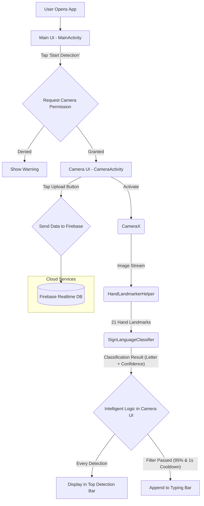

# JariBicara: Real-time Sign Language Translator

**JariBicara** is a prototype Android application designed to translate static Indonesian Sign Language (BISINDO) alphabets into text in real-time using the device's camera. This application is built with a modern architecture, integrating **On-Device Machine Learning** with a declarative UI and cloud services.

---

## 👥 Collaborators

| Name | Role |
| :--- | :--- |
| **Syahrul Huda** | Project Lead & AI Specialist |
| **Awang Budi** | Mobile App Specialist |
| **Wildan Rafi** | UI/UX Designer |

---

## 🚀 Key Features

- **Real-time Translation**: Utilizes the camera to detect and translate hand signs instantly.
- **Intelligent Typing Logic**: Equipped with a confidence filter (95%) and a cooldown timer (1 second) to ensure accurate, natural text generation and prevent duplicate entries.
- **Dual Camera Support**: Allows users to seamlessly switch between front and rear cameras.
- **Cloud Integration**: Translated text can be uploaded to Firebase Realtime Database for history storage.
- **Modern UI**: The entire interface is built using Jetpack Compose for a clean, responsive, and intuitive user experience.
- **On-Device Detection**: Detection and classification processes run entirely on the device, ensuring privacy and functionality without an internet connection for core features.

---

## 🏗️ Architecture & Workflow

The application follows an architecture that decouples detection logic, UI rendering, and external services.

### Data Flow Diagram
This diagram illustrates how image data from the camera is processed into text and stored in the cloud.



### Data Flow Details & Responsible Components
Below is a step-by-step breakdown of how data moves through the application and the components responsible for each stage.

1.  **Image Acquisition**
    *   **Source**: Device Camera Sensor.
    *   **Component**: `CameraActivity.kt`
    *   **Key Function**: `ImageAnalysis.Builder()` (from CameraX library) configured within a `LaunchedEffect` in the `CameraScreen` Composable.
    *   **Output**: `ImageProxy` (raw image frame representation per unit of time).

2.  **Image Pre-processing**
    *   **Source**: `ImageProxy`.
    *   **Component**: `CameraActivity.kt`.
    *   **Key Function**: Lambda within `analyzer.setAnalyzer { ... }`.
    *   **Process**: Invokes `imageProxy.toBitmap()` and performs rotation/mirroring using a `Matrix` object.
    *   **Output**: `Bitmap` (ready for analysis).

3.  **Hand Landmark Detection**
    *   **Source**: `Bitmap`.
    *   **Component**: `HandLandmarkerHelper.kt`.
    *   **Key Function**: `detectLiveStream(bitmap)`. Internally, `handLandmarker.detectAsync()` is called to run the MediaPipe model.
    *   **Output**: Asynchronous detection of 21 hand landmark points.

4.  **Landmark Data Delivery to UI**
    *   **Source**: Result from `handLandmarker.detectAsync()`.
    *   **Component**: `HandLandmarkerHelper.kt` and `CameraActivity.kt`.
    *   **Key Function**: Detection results are sent via the `handLandmarkerResultsListener.onResults(...)` interface. `CameraActivity` acts as the observer for these results.
    *   **Output**: `HandLandmarkerHelper.ResultBundle` containing landmark coordinates.

5.  **Sign Classification**
    *   **Source**: 21 landmark points from `ResultBundle`.
    *   **Component**: `SignLanguageClassifier.kt`.
    *   **Key Function**: `classify(landmarks)`. Called from the `handLandmarkerResultsListener` in `CameraActivity.kt`.
    *   **Process**: Converts 21 landmarks into 42 floating-point values, populates a `ByteBuffer`, and executes inference via the TensorFlow Lite interpreter.
    *   **Output**: `ClassificationResult` data object (containing the predicted `sign` and `confidence` score).

6.  **Intelligent Logic & Typing Implementation**
    *   **Source**: `ClassificationResult` object.
    *   **Component**: `CameraActivity.kt`.
    *   **Key Function**: Conditional logic block within `handLandmarkerResultsListener`.
    *   **Process**: Validates three conditions: `confidence > 95%`, non-duplicate sign, and >1 second time interval since the last character.
    *   **Output**: Update to the `typedText` state variable.

7.  **UI Updates (Recomposition)**
    *   **Source**: Changes in `typedText` and `classificationResult` state variables.
    *   **Component**: Jetpack Compose.
    *   **Key Function**: `Text(text = typedText)` and `Text(text = classificationResult)` Composables.
    *   **Process**: Jetpack Compose automatically detects state changes and performs recomposition only on relevant UI components.
    *   **Output**: Real-time UI updates for the user.

8.  **Firebase Persistence**
    *   **Source**: `typedText` state variable.
    *   **Component**: `CameraActivity.kt`.
    *   **Key Function**: `onClick` block of the "Upload" `IconButton`.
    *   **Process**: Executes `database.child("detections").push().setValue(...)` to transmit data to the cloud.
    *   **Output**: Data successfully stored in Firebase Realtime Database.

---

## ⏳ Lifecycle & State Management in Jetpack Compose

Managing the lifecycle and state in `CameraActivity` is critical for performance and resource efficiency.

1.  **`remember`**:
    *   UI states like `typedText`, `classificationResult`, and `cameraSelector` are preserved using `remember { mutableStateOf(...) }`, ensuring data persistence across recompositions.

2.  **`LaunchedEffect`**:
    *   Used to initialize the camera (binding `Preview` and `ImageAnalysis` to the lifecycle).
    *   Triggered when `CameraScreen` enters the composition and automatically restarts if the `cameraSelector` state changes (e.g., when switching cameras).

3.  **`DisposableEffect`**:
    *   Crucial for resource cleanup. When the user leaves the `CameraScreen`, the `onDispose` block is executed.
    *   **Critical Snippet (`CameraActivity.kt`):**
        ```kotlin
        DisposableEffect(lifecycleOwner) {
            onDispose {
                cameraExecutor.shutdown() // Shuts down camera threads
                handLandmarkerHelper.clearHandLandmarker() // Releases AI model from memory
            }
        }
        ```
    *   Prevents memory leaks and ensures hardware/model resources are properly released.

---

## 📁 Project Structure

```
.
├── app/
│   ├── src/main/
│   │   ├── java/com/example/signdecs/
│   │   │   ├── MainActivity.kt        # Entry point / Splash screen
│   │   │   ├── CameraActivity.kt      # Camera UI, detection logic, and state management
│   │   │   ├── HandLandmarkerHelper.kt # Helper for MediaPipe Hand Landmarker
│   │   │   └── SignLanguageClassifier.kt # TFLite model inference engine
│   │   ├── assets/
│   │   │   ├── hand_landmarker.task
│   │   │   ├── revised_hand_sign_model.tflite
│   │   │   └── labels.txt
│   │   └── google-services.json       # Firebase configuration file
│   └── build.gradle.kts             # Build configurations and dependencies
├── trainlab/
│   └── trainlab.ipynb               # Jupyter Notebook for AI model training
└── README.md                        # Project documentation
```

---

## 🛠️ Technologies Used

- **Language**: Kotlin
- **UI Framework**: Jetpack Compose (Declarative UI)
- **Camera API**: CameraX (Android Jetpack)
- **Hand Landmark Detection**: Google MediaPipe
- **Model Inference**: Google TensorFlow Lite
- **Backend**: Google Firebase (Realtime Database)
- **Build System**: Gradle

---

## ⚙️ How to Run the Project

1.  **Clone** this repository to your local machine.
2.  Open the project using the latest version of **Android Studio**.
3.  **Important**: Download your own `google-services.json` from the Firebase Console and place it in the `app/` directory.
4.  Perform a **Sync Project with Gradle Files** to download all necessary dependencies.
5.  Build and run the application on a physical Android device or emulator.
